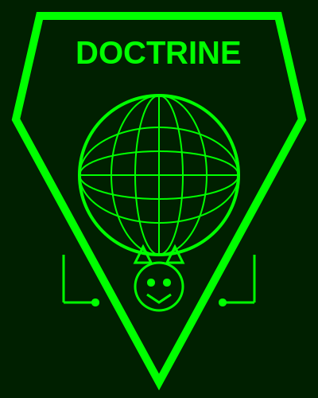

# Enterprise Cyber Defense Doctrine Manual

## Overview
The **Enterprise Cyber Defense Doctrine Manual** is an open-source project designed to help organizations align cybersecurity outcomes directly with business objectives.  
It moves beyond tools and technologies, focusing instead on **first principles** — *People, Processes, and Capabilities* — to shape a resilient, business-aligned cyber defense posture.  

This repository provides a full manual in Markdown format, along with field-card style summaries for practitioners who need quick reference in the field.

---

## Why This Project?
Today’s cybersecurity industry often focuses heavily on vendor solutions, tools, and novelty technologies. While important, they don’t address the **foundational doctrine** needed to consistently achieve business-aligned outcomes.  

This project provides that foundation — a **living doctrine** that practitioners can adapt, adopt, and refine within their own enterprises.

---

## Structure
The manual is organized into chapters, each addressing a critical component of enterprise cyber defense:

1. **Philosophy & First Principles**  
2. **People – Workforce Development & Career Pathing**  
3. **Processes – Foundational Cybersecurity Outcomes**  
4. **Capability – Aligning Outcomes with Business Strategy**  
5. **Governance & Risk Alignment**  
6. **Operationalizing the Doctrine**  
7. **Continuous Renewal & Benchmarking**  

### Practitioner Field Cards
Each chapter includes **Field Cards** — concise, actionable checklists for quick use by cybersecurity practitioners and leaders.

---

## How to Use
- **As-Is Doctrine**: Organizations can adopt the manual directly as their guiding doctrine.  
- **Internal Adaptation**: Practitioners are encouraged to fork this repository and tailor the doctrine to their unique enterprise context.  
- **Reference Guide**: The field cards serve as quick references during planning, training, and operational response.  

---

## Contributing
We welcome contributions from the cybersecurity community. Collaboration is the core of this project.

### Ways to Contribute
- **Propose Edits:** Submit pull requests with suggested improvements or clarifications.  
- **Add Case Studies:** Share real-world applications or lessons learned.  
- **Expand Field Cards:** Create additional practitioner reference materials.  
- **Framework Crosswalks:** Map doctrine components to industry frameworks (e.g., NIST CSF 2.0, NICE, ISO 27001).  

### Contribution Guidelines
1. Fork the repository.  
2. Create a new branch for your edits.  
3. Submit a pull request with a clear description of your changes.  
4. Ensure your contributions maintain a **business-aligned, first principles approach**.  

---

## Roadmap
- [ ] Add diagrams and visuals (CSF wheel, People–Process–Tech Venn, Maturity Roadmap).  
- [ ] Build sector-specific doctrine extensions (finance, healthcare, retail, manufacturing).  
- [ ] Incorporate community-contributed playbooks.  
- [ ] Develop a companion **Quick Start Guide**.  

---

## License
This project is released under the **MIT License**.  
You are free to use, modify, and distribute the manual, with attribution.

---

## Acknowledgments
This project builds on insights from:  
- **NIST Cybersecurity Framework (CSF) 2.0**  
- **NIST NICE Workforce Framework (SP 800-181r1)**  
- **Enterprise Cyber Defense Benchmarking research (HTB 2025)**  
- **Practitioner experiences and field-tested doctrine**

---

## Contact
Maintained by: **[Your Name / HybridSec](https://hybridsec.org/)**  
Questions or suggestions? Open an [issue](./issues) or reach out via GitHub Discussions.

---

### Closing Note
This manual is a **living covenant between practitioners and the business**.  
By contributing, you help shape a doctrine that not only protects but **enables mission success** for organizations worldwide.
